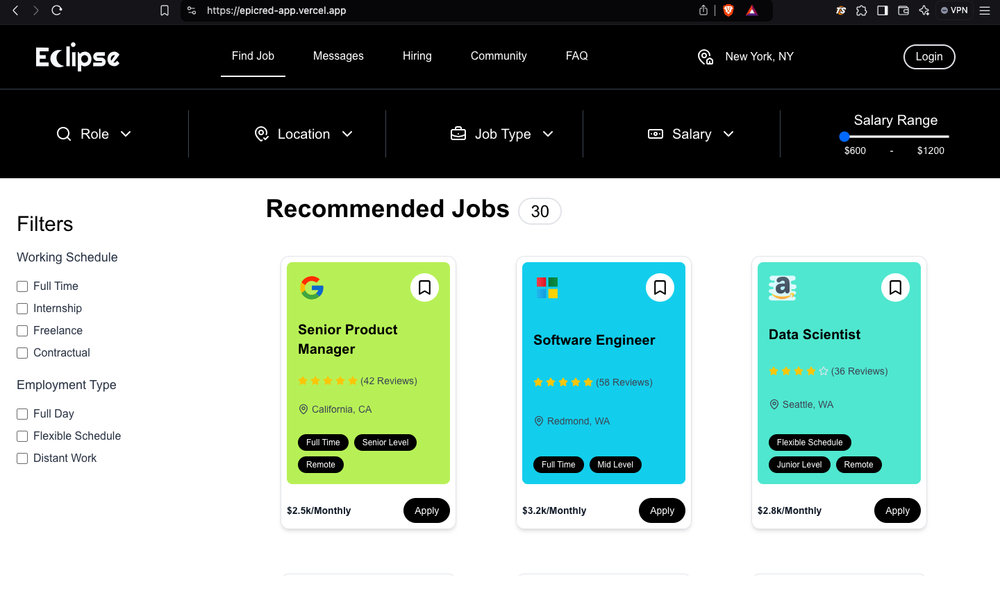
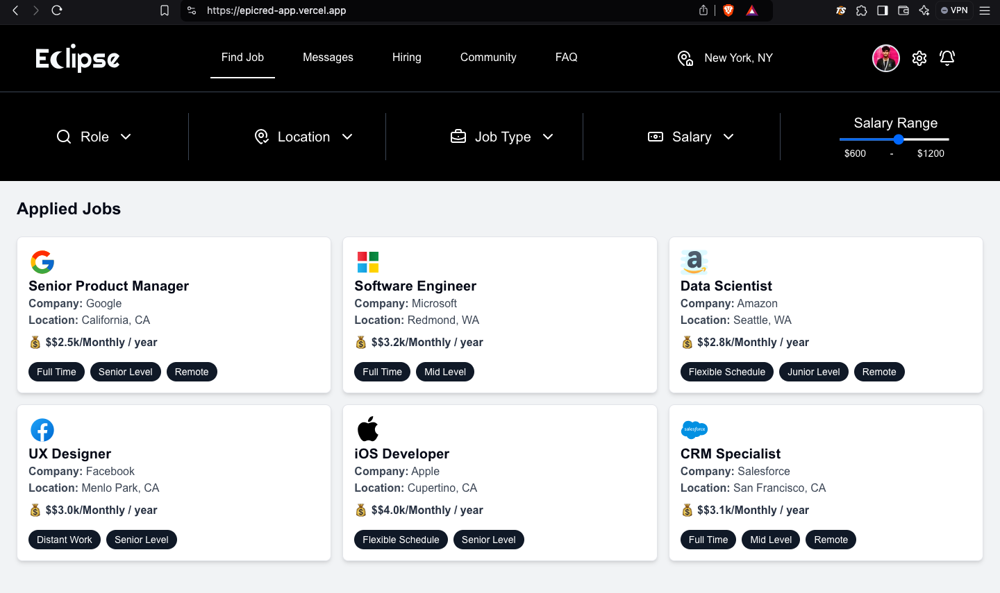
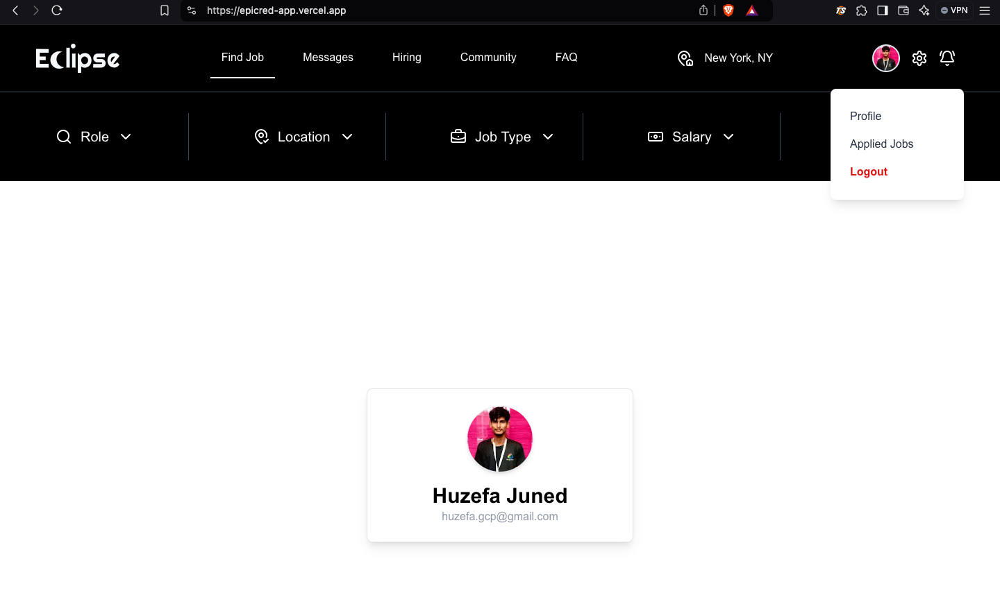
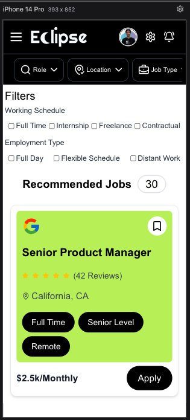
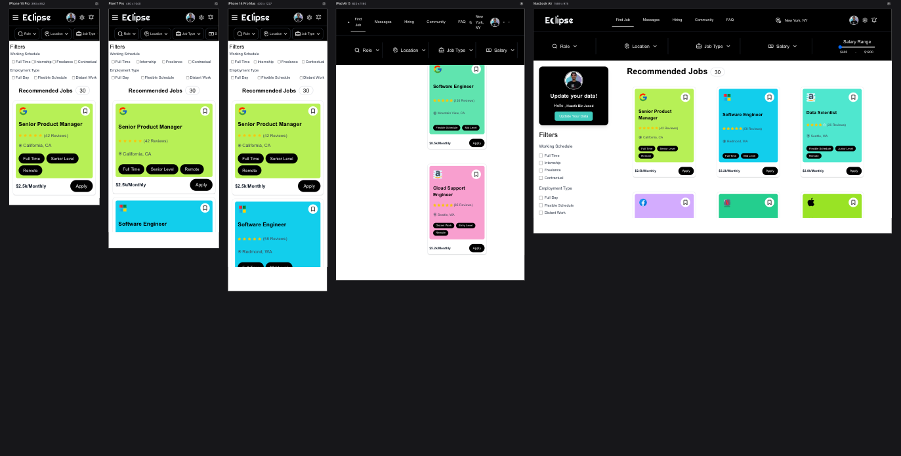
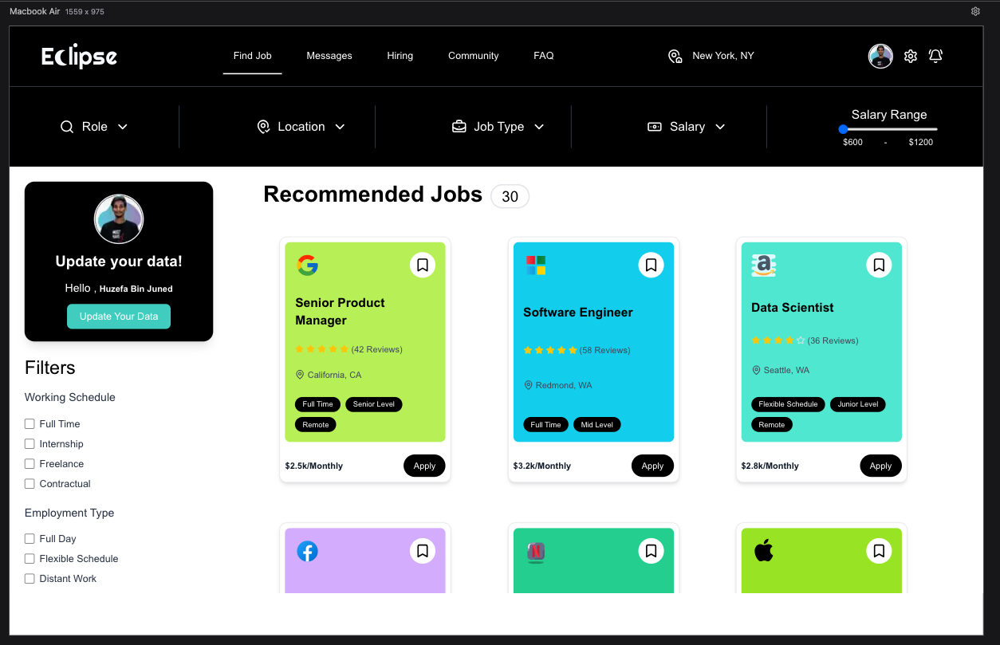
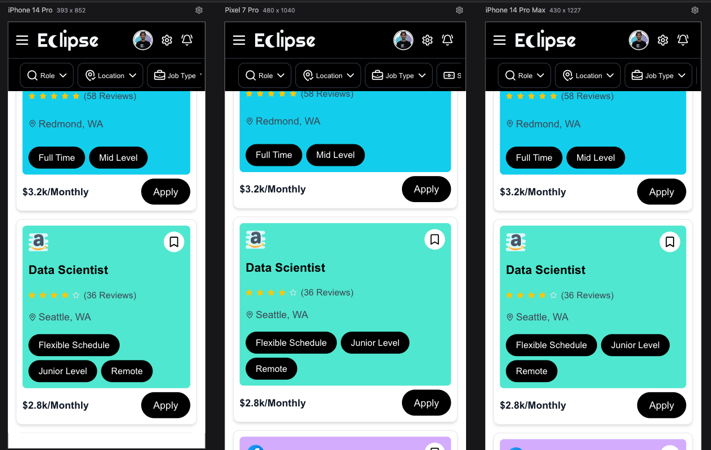

# Epicred - Job Application Dashboard

This is a **Job Application Dashboard** built using **Next.js, TypeScript, and Tailwind CSS**. The platform allows users to browse job listings, apply for jobs, and track their applications.

## 🚀 Features

- ✅ View a list of job postings
- ✅ Apply for a job through a form
- ✅ Track applied jobs in a separate section
- ✅ Modern, responsive UI

## 📸 Screenshots

Here are some previews of the application:









## 🔧 Tech Stack

- **Next.js (App Router)** - Server-side rendering (SSR) and static generation (SSG)
- **React.js** - Component-based UI
- **Firebase** - User Authentication / Authorization
- **TypeScript** - Ensures type safety
- **Tailwind CSS** - For a clean and responsive UI
- **State Management** - Context API
- **Custom Hooks** - Hooks

## 🛠️ Installation

Clone the repository and install dependencies:

```bash
# Clone the repository
git clone https://github.com/your-username/epicred.git

# Navigate to the project directory
cd epicred

# Install dependencies
npm install  # or yarn install
```

## 🚀 Running the Project

Start the development server:

```bash
npm run dev  # or yarn dev
```

Open [http://localhost:3000](http://localhost:3000) in your browser.

Happy coding! 🚀
